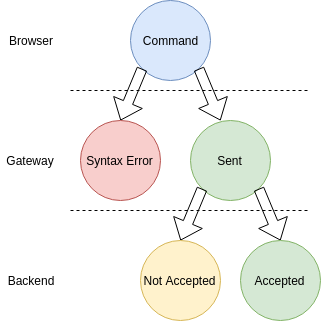

# v1.0

# Table of contents
* [<-- Back](../../readme.md#table-of-contents)
* [1 Frontend - Gateway v1.0](#1-frontend---gateway-v10)
* [1.1 After Connection: Handshake](#11-after-connection-handshake)
* [1.1.1 Success Flow](#111-success-flow)
* [1.1.2 Fails](#112-fails)
* [1.2 Commands](#12-commands)
* [1.3 Actions](#13-actions)
* [1.4 Redirect](#14-redirect)
* [1.5 Errors](#15-errors)

# 1 Frontend - Gateway v1.0

## 1.1 After Connection: Handshake

### 1.1.1 Success Flow

After connection is established, the `Browser` needs to send handshake in this form:

Browser -> Gateway
```json
{
  "type": "handshake",
  "protocol_version": "1.0"
}
```

After that, the `Gateway` will send success handshake:

Gateway -> Browser
```json
{
  "type": "handshake",
  "result": "ok",
  "browser_id" "{uuid}"
}
```

### 1.1.2 Fails

On errors, the `Gateway` can send errors.

* Wrong Api version.

  The `Gateway` is not able to handle the protocol version (because it is too
  old or too new)

  Gateway -> Browser
  ```json
  {
    "type": "handshake",
    "result": "fail",
    "number": 1,
    "message": "Unsupported protocol version"
  }
  ```

* Can not create queue

  The `Gateway` can not create queue (in RabbitMQ) for screen or backend

  Gateway -> Browser
  ```json
  {
    "type": "handshake",
    "result": "fail",
    "number": 2,
    "message": "Can not create queue"
  }
  ```

## 1.2 Commands

Browser can send commands to backend using gateway. This command can not return
any data, but the `Backend` can send command (see below), so the `Browser` needs
to generate random `command_id` for each command. Handling to the command needs
to be implemented by the backend. This is asynchronus, so the `Browser` is
unable to check if the command is running or not.

Browser -> Gateway
```json
{
  "type": "command",
  "name": "{name}",
  "command_id": "{command_id}",
  "params": {}
}
```

Response from the `Gateway` will return status of the command, which can change
in time. That is why there can be more status updates in the future.

`status` parameter can be one of:

  * `syntax error` - command structure was not validated (do the browser use
  proper protocol version?)
  * `sent` - command sent to backend, but no acceptance was returned. This can be
  result of an situation, when the command was sent to more than one consumer,
  and the gateway is not able to tell if the command was accepted for any of the
  workers.
  * `accepted` - command send to backend and accepted by the backend
  * `not accepted` - command was not accepted by any workers. This can or can not
  be implemented by the backend.



Gateway -> Browser
```json
{
  "type": "command_status",
  "command_id": "{command_id}",
  "status": "{status}"
}
```

## 1.3 Actions

`Backend` can send actions to the `Browser`. This is not a result of anything
and can be

Backend -> Browser
```json
{
  "type": "action",
  "name": "{name}",
  "command_id": "{command_id|nullable}",
  "params": {}
}
```

## 1.4 Redirect

Backend -> Browser
```json
{
  "type": "redirect",
  "name": "{name|nullable}",
  "path": "{path|nullable}",
  "params": {}
}
```

## 1.5 Errors

* Other errors

  Gateway -> Browser
  ```json
  {
    "type": "error",
    "number": 1,
    "message": "Unsupported Gateway error"
  }
  ```

