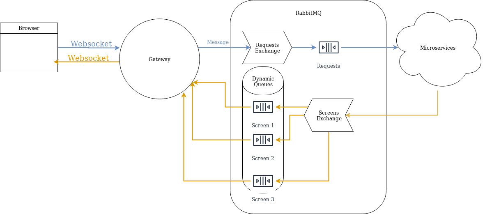

## Table of contents
* [1. About](#1-about)
* [2. How is it working?](#2-how-is-it-working?)
* [2.1 Architecture](#21-architecture)
* [2.2 Data Flow](#22-data-flow)

# 1. About

Screen Ape is a tool for creating dynamic pages, which will serve as a screen. Normal pages are designed to act on user input. The Ape will allow to react on the server input.

It should help creating applications for read only presentations on tv screens.

# 2. How is it working?
# 2.1 Architecture

This project is splitted in three parts:
- frontend client
- gateway
- backend client

# 2.1.1 Gateway

Gateway is responsible for pushing the data from frontend to the backend and from backend to frontend.

# 2.1.2 Frontend Client

Frontend Client is resposible for connecting and communication to Gateway thru websocket.

# 2.1.2 Backend Client

Backend Client is responsible for connecting and communication to Gateway thru RabbitMQ.

# 2.2 Data Flow

Frontend can send data to the Backend, but it also needs to react on the actions which the backend is sending. Backend can target certain browser.
